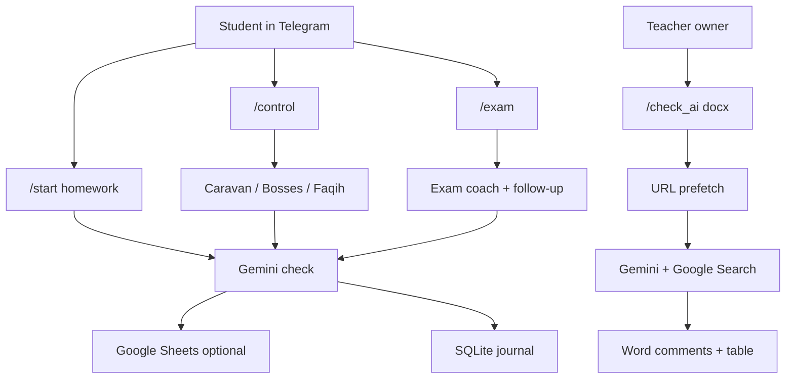

# Tutor Bot

Telegram bot for a Middle East / Islamic studies course: **homework make-ups**, **interactive midterm**, **oral-exam coach**, and a **teacher citation checker**. Answers are graded with Vertex Gemini; grades can sync to Google Sheets, with an optional SQLite submission log.

> Portfolio snapshot with **demo content only**. The full course pack is not published.

## Problem

Course work piles up in chat: make-up essays, midterms, exam prep, and student papers with shaky footnotes. Checking all of that by hand is slow and uneven. Tutor Bot turns those flows into structured Telegram sessions — students practice and submit, Gemini grades against fixed criteria, and the teacher gets Sheets/SQLite logs plus a DOCX citation review instead of hunting sources manually.

## Highlights (what to look at)

### 1. Interactive control — `/control`

Three game modes over the same question pool (`data/control_pool.json`):

| Mode | Mechanic | Scoring idea |
|------|----------|--------------|
| **Caravan** | Open answers at city stops; easier fallback on fail | Seals / stops → 0–7 |
| **Bosses** | Debate: refute an opponent thesis; Gemini judges | Defeated bosses → 0–7 |
| **Faqih** | Multiple choice with 50/50, hint, one redo | Correct count scaled to 0–7 |

Best grade wins on retake when Sheets is configured.

### 2. Oral exam trainer — `/exam`

- **Block 1** — topic (~5 min), two terms, short essay  
- **Block 3** — dates, personalities, terms, periods (modern Arab world showcase)  
- Text or **voice**; Gemini asks a follow-up, then gives strengths / gaps / how to improve  

Demo pools: `data/exam_train_block1.json`, `data/exam_train_block3.json`.

### 3. Homework / make-up flow — `/start`

Student picks block → assignment type → seminar → answer. Gemini checks against criteria in `assignments.json`. Accepted work can be written to Sheets (block 1 / block 3 spreadsheets).

### 4. Citation check for teachers — `/check_ai`

Owner-only. Send a `.docx` with classic Word footnotes. The bot:

1. Parses footnotes + paragraph context (segment before each marker)  
2. Prefetches URLs from footnote text (HTTP title / snippet / status)  
3. Asks Gemini + Google Search whether the source likely exists and matches the claim  
4. Returns a short Telegram summary, an **annotated copy** with Word comments on flagged footnotes, and a **flagged-only table** (`exists` / `does not exist` / `needs re-check`)

Package: `citation/` (`docx_footnotes`, `url_fetch`, `checker`, `annotate_docx`, `handlers`).

### 5. Ops

- SQLite submission log; owner commands `/submissions_stats`, `/export_submissions`, `/check_ai`  
- Deploy scripts + systemd unit (see `DEPLOY.md`)

## Stack

| Layer | Tech |
|-------|------|
| Bot | Python, `python-telegram-bot` |
| AI | Vertex Gemini (`google-cloud-aiplatform` / `google-genai`) |
| Grades | Google Sheets (`gspread`) |
| Journal | SQLite |
| DOCX | `python-docx` + OOXML parse/annotate |
| Content | JSON pools (`assignments.json`, `control_pool.json`, `exam_train_*.json`) |



## Quick start

```bash
cd tutor
python -m venv venv
# Windows: venv\Scripts\activate
pip install -r requirements.txt
cp .env.example .env
# set TELEGRAM_BOT_TOKEN, GOOGLE_PROJECT_ID, GOOGLE_APPLICATION_CREDENTIALS
python main.py
```

Sheets IDs are optional for trying `/control` and `/exam` locally (grades simply will not sync).

## Demo content note

This repo ships a **short demo** question set so `/control` and `/exam` run out of the box. Replace JSON files with your own course materials for production. Do not commit real student databases or spreadsheet IDs with live grades.

## Deploy

See [DEPLOY.md](DEPLOY.md). Use `YOUR_VPS_HOST` and your own secrets; never commit `.env` or service-account keys.
